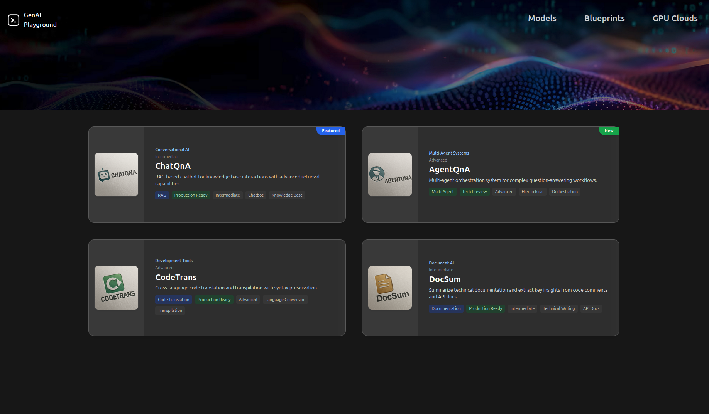

# GenAI Playground

A modern web application for exploring and interacting with AI models and blueprints, built with React, TypeScript, and Vite.

## Table of Contents

- [Features](#features)
- [Screenshots](#screenshots)
- [Prerequisites](#prerequisites)
- [Getting Started](#getting-started)
  - [Standard Installation](#standard-installation)
  - [WSL2 Installation (Windows)](#wsl2-installation-windows)
- [Available Scripts](#available-scripts)
- [Project Structure](#project-structure)
- [Technologies Used](#technologies-used)
- [Contributing](#contributing)
- [License](#license)

## Features

- **Models Catalog**: Browse and explore different AI models
- **Blueprints**: Interactive AI application templates including ChatQnA, CodeGen, and more
- **GPU Cloud Integration**: Cloud computing resources for AI workloads
- **Real-time Interaction**: Chat interfaces and code generation tools

## Screenshots

### Landing Page

*Modern landing page with navigation to Models, Blueprints, and GPU Cloud sections*

### Models Section

*Comprehensive catalog of AI models with filtering and search capabilities*


*Detailed model information with specifications and capabilities*


*Interactive chat interface for testing AI models with real-time responses*

### Blueprints Section

*Collection of AI application blueprints including ChatQnA, CodeGen, and more*


*Detailed blueprint information with architecture and use cases*


*AI Model Integration and Management System (AIMs) showing models and functional microservices*

### Functional Microservices

*Overview of functional microservices with detailed descriptions and capabilities*


*Interactive interface for testing functional microservices*


*Code generation and API integration examples for functional microservices*

### GPU Cloud

*GPU Cloud management interface for AI workload deployment and monitoring*

## Prerequisites

- Node.js (version 18 or higher)
- npm (comes with Node.js)
- Git

## Getting Started

### Standard Installation

#### 1. Clone the Repository
```bash
git clone <your-github-repo-url>
cd ih-mockup-demo
```

#### 2. Install Dependencies
```bash
npm install
```

**Note**: If you encounter any missing icon dependencies, you may need to install react-icons:
```bash
npm install react-icons
```

#### 3. Start the Development Server
```bash
npm run dev
```

The application will be available at `http://localhost:5173`

#### 4. Alternative Port (if 5173 is busy)
```bash
npm run dev -- --port 3000
```

### WSL2 Installation (Windows)

If you're running Windows with WSL2, follow these specific instructions:

#### 1. Install WSL2 (if not already installed)
```powershell
# In Windows PowerShell as Administrator
wsl --install
```

#### 2. Install Node.js in WSL2
```bash
# Update package list
sudo apt update

# Install Node.js and npm
curl -fsSL https://deb.nodesource.com/setup_18.x | sudo -E bash -
sudo apt-get install -y nodejs

# Verify installation
node --version
npm --version
```

#### 3. Install Git in WSL2
```bash
sudo apt install git
```

#### 4. Clone and Run the Project
```bash
# Navigate to your preferred directory (recommended: WSL2 file system)
cd ~/Desktop
git clone <your-github-repo-url>
cd ih-mockup-demo

# Install dependencies
npm install

# Start the development server
npm run dev
```

#### 5. Access the Application
- **Primary**: Open `http://localhost:5173` in your Windows browser
- **Alternative**: If localhost doesn't work, use the WSL2 IP address:
  ```bash
  # Get WSL2 IP address
  ip addr show eth0 | grep "inet\b" | awk '{print $2}' | cut -d/ -f1
  ```
  Then access: `http://<WSL2-IP>:5173`

#### 6. WSL2-Specific Tips

**File System Performance:**
- ✅ **Best**: Clone the project inside WSL2 file system (`/home/username/`)
- ❌ **Avoid**: Cloning in Windows file system (`/mnt/c/`) as it can be slower

**VS Code Integration:**
1. Install the "Remote - WSL" extension in VS Code
2. Open VS Code in WSL2: `code .` (from the project directory)
3. This gives you full IDE features while working in the Linux environment

**If localhost doesn't work:**
```bash
# Use host flag to bind to all interfaces
npm run dev -- --host 0.0.0.0
```

**Port Forwarding (if needed):**
```powershell
# In Windows PowerShell as Administrator
netsh interface portproxy add v4tov4 listenport=5173 listenaddress=0.0.0.0 connectport=5173 connectaddress=<WSL2-IP>
```

**Troubleshooting:**
```bash
# Fix npm permissions if needed
mkdir ~/.npm-global
npm config set prefix '~/.npm-global'
echo 'export PATH=~/.npm-global/bin:$PATH' >> ~/.bashrc
source ~/.bashrc

# Restart WSL2 if needed (in Windows PowerShell as Administrator)
wsl --shutdown
wsl
```

## Available Scripts

- `npm run dev` - Start development server
- `npm run build` - Build for production
- `npm run preview` - Preview production build
- `npm run lint` - Run ESLint

## Project Structure

```
src/
├── components/     # Reusable React components
├── pages/         # Page components
├── assets/        # Static assets (images, etc.)
├── data/          # Data files
└── App.tsx        # Main application component
```

## Technologies Used

- React 18
- TypeScript
- Vite
- Tailwind CSS
- React Router
- Heroicons
- React Icons

## Contributing

1. Fork the repository
2. Create a feature branch
3. Make your changes
4. Submit a pull request

## License

[Your License Here]
