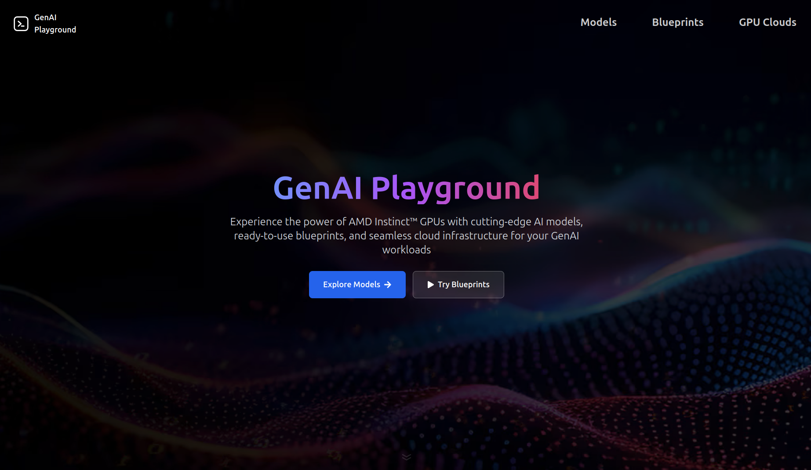
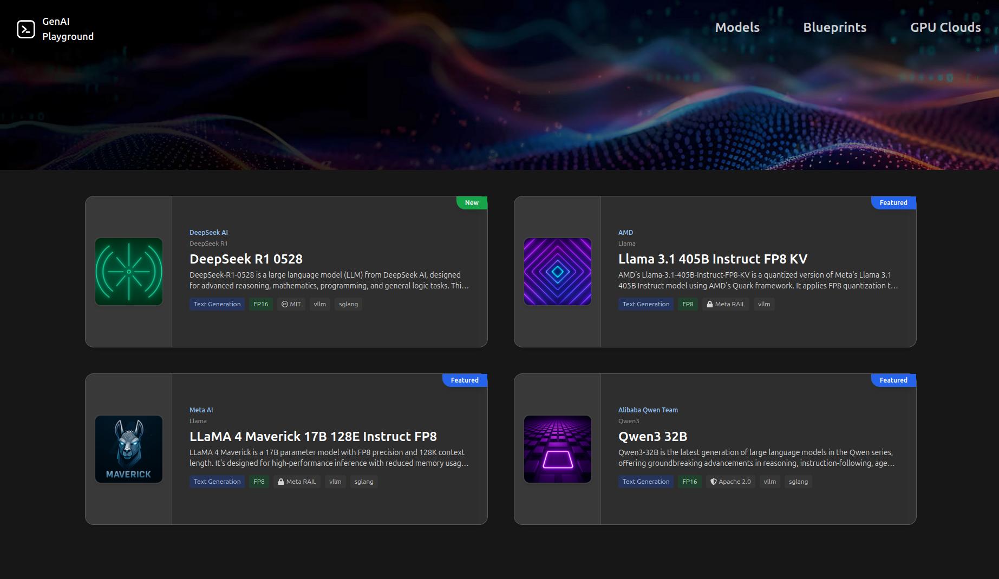

# GenAI Playground

A modern web application for exploring and interacting with AI models and blueprints, built with React, TypeScript, and Vite.

## Table of Contents

### 🚀 Getting Started
- [Features](#features)
- [Screenshots](#screenshots)
- [Prerequisites](#prerequisites)
- [Installation](#installation)
  - [Standard Installation](#standard-installation)
  - [WSL2 Installation (Windows)](#wsl2-installation-windows)

### 🛠️ Development
- [Available Scripts](#available-scripts)
- [Project Structure](#project-structure)
- [Technologies Used](#technologies-used)
- [Testing & Validation](#testing--validation)

### 📚 Catalog Management
- [Model Catalog Assets](#model-catalog-assets)
- [Blueprint Catalog Assets](#blueprint-catalog-assets)
- [AIM (AMD Inference Microservice) Assets](#aim-amd-inference-microservice-assets)
- [Cloud Inference Endpoint Migration](#cloud-inference-endpoint-migration)
- [Catalog Validation](#catalog-validation)

### 🤝 Contributing
- [Contributing Guidelines](#contributing)
- [Maintainer](#maintainer)
- [License](#license)

## Features

- **Models Catalog**: Browse and explore different AI models
- **Blueprints**: Interactive AI application templates including ChatQnA, CodeGen, and more
- **GPU Cloud Integration**: Cloud computing resources for AI workloads
- **Real-time Interaction**: Chat interfaces and code generation tools

## Screenshots

### Landing Page

*Main landing page showcasing the GenAI Playground interface*

### Model Catalog

*Browse and explore different AI models with detailed information*

### Model Interaction

*Interactive chat interface for model conversations*

### Model Tools

*Tool calling interface for enhanced model capabilities*

### Model Tools Instructions

*Detailed instructions for using model tools*

### Model Behavior Parameters

*Configure model behavior and parameters*

### Model Deployment Guide

*Comprehensive deployment instructions for models*

### Model Card

*Detailed model information and specifications*

### Blueprint Catalog

*Browse available AI application blueprints*

### Blueprint ChatQnA Interaction

*Interactive ChatQnA blueprint with RAG capabilities*

### Blueprint Card

*Detailed blueprint information and overview*

### Blueprint AIMs

*AMD Inference Microservices architecture view*

### GPU Cloud Overview

*Main GPU cloud overview page with all available cloud providers*

### GPU Cloud Overview (Alternative View)

*Alternative view of the GPU cloud overview page*

### AMD Developer Cloud

*AMD Developer Cloud page with tutorial video integration*

### AMD Developer Cloud Setup

*AMD Developer Cloud setup page with video tutorials*

### Oracle Cloud Infrastructure

*Oracle Cloud Infrastructure deployment page*

### Oracle Cloud Infrastructure Deployment

*Oracle Cloud Infrastructure deployment interface*

### Oracle Cloud Infrastructure Management

*Oracle Cloud Infrastructure management and monitoring interface*

## Prerequisites

- Node.js (version 18 or higher)
- npm (comes with Node.js)
- Git

## Installation

### Standard Installation

#### 1. Clone the Repository
```bash
git clone <your-github-repo-url>
cd ih-mockup-demo
```

#### 2. Install Dependencies
```bash
npm install
```

**Note**: If you encounter any missing icon dependencies, you may need to install react-icons:
```bash
npm install react-icons
```

#### 3. Start the Development Server
```bash
npm run dev
```

The application will be available at `http://localhost:5173`

#### 4. Alternative Port (if 5173 is busy)
```bash
npm run dev -- --port 3000
```

### WSL2 Installation (Windows)

If you're running Windows with WSL2, follow these specific instructions:

#### 1. Install WSL2 (if not already installed)
```powershell
# In Windows PowerShell as Administrator
wsl --install
```

#### 2. Install Node.js in WSL2
```bash
# Update package list
sudo apt update

# Install Node.js and npm
curl -fsSL https://deb.nodesource.com/setup_18.x | sudo -E bash -
sudo apt-get install -y nodejs

# Verify installation
node --version
npm --version
```

#### 3. Install Git in WSL2
```bash
sudo apt install git
```

#### 4. Clone and Run the Project
```bash
# Navigate to your preferred directory (recommended: WSL2 file system)
cd ~/Desktop
git clone <your-github-repo-url>
cd ih-mockup-demo

# Install dependencies
npm install

# Start the development server
npm run dev
```

#### 5. Access the Application
- **Primary**: Open `http://localhost:5173` in your Windows browser
- **Alternative**: If localhost doesn't work, use the WSL2 IP address:
  ```bash
  # Get WSL2 IP address
  ip addr show eth0 | grep "inet\b" | awk '{print $2}' | cut -d/ -f1
  ```
  Then access: `http://<WSL2-IP>:5173`

#### 6. WSL2-Specific Tips

**File System Performance:**
- ✅ **Best**: Clone the project inside WSL2 file system (`/home/username/`)
- ❌ **Avoid**: Cloning in Windows file system (`/mnt/c/`) as it can be slower

**VS Code Integration:**
1. Install the "Remote - WSL" extension in VS Code
2. Open VS Code in WSL2: `code .` (from the project directory)
3. This gives you full IDE features while working in the Linux environment

**If localhost doesn't work:**
```bash
# Use host flag to bind to all interfaces
npm run dev -- --host 0.0.0.0
```

**Port Forwarding (if needed):**
```powershell
# In Windows PowerShell as Administrator
netsh interface portproxy add v4tov4 listenport=5173 listenaddress=0.0.0.0 connectport=5173 connectaddress=<WSL2-IP>
```

**Troubleshooting:**
```bash
# Fix npm permissions if needed
mkdir ~/.npm-global
npm config set prefix '~/.npm-global'
echo 'export PATH=~/.npm-global/bin:$PATH' >> ~/.bashrc
source ~/.bashrc

# Restart WSL2 if needed (in Windows PowerShell as Administrator)
wsl --shutdown
wsl
```

## Available Scripts

### Development Scripts
- `npm run dev` - Start development server
- `npm run build` - Build for production
- `npm run preview` - Preview production build
- `npm run lint` - Run ESLint
- `npm run lint:fix` - Fix ESLint issues
- `npm run type-check` - Run TypeScript type checking
- `npm run format` - Format code with Prettier
- `npm run format:check` - Check code formatting

### Testing Scripts
- `npm test` - Run all tests
- `npm run test:ui` - Run tests with UI
- `npm run test:coverage` - Run tests with coverage
- `npm run test:watch` - Run tests in watch mode

### Data Management Scripts
- `npm run generate-model-data` - Generate model data from YAML files
- `npm run validate-model-data` - Validate model data
- `npm run generate-blueprint-data` - Generate blueprint data from YAML files
- `npm run validate-blueprint-data` - Validate blueprint data
- `npm run convert-blueprints` - Convert individual blueprint YAMLs to catalog
- `npm run validate-blueprint-catalog` - Validate blueprint catalog against schema

### Quality Assurance Scripts
- `npm run ci:quality` - Run quality checks (type-check, lint, format)
- `npm run ci:test` - Run tests with coverage
- `npm run ci:build` - Build for production
- `npm run ci:security` - Run security audit
- `npm run ci:validate` - Validate model data and markdown
- `npm run pre-commit` - Run all quality checks

## Project Structure

```
src/
├── components/          # Reusable React components
├── pages/              # Page components
├── assets/             # Static assets (images, etc.)
├── data/               # Data files
├── utils/              # Utility functions and loaders
├── tests/              # Unit tests
├── modelcards/         # Model documentation markdown files
├── aim/                # AIM (AI Model Integration) files
│   ├── models/         # Model YAML definitions
│   ├── blueprints/     # Blueprint YAML definitions
│   ├── schemas/        # JSON schemas for validation
│   └── templates/      # Templates for new entries
└── App.tsx             # Main application component
```

## Technologies Used

### Frontend
- React 18
- TypeScript
- Vite
- Tailwind CSS
- React Router
- Heroicons
- React Icons

### Development Tools
- ESLint
- Prettier
- Vitest
- TypeScript

### Data Management
- YAML/JSON schemas
- js-yaml
- Ajv (JSON Schema validation)

## Testing & Validation

### Unit Tests
- **Location:** `src/tests/`
- **Framework:** Vitest
- **Coverage:** Includes model and blueprint components
- **Run:** `npm test`

### Data Validation
- **Model Data:** `npm run validate-model-data`
- **Blueprint Data:** `npm run validate-blueprint-data`
- **Blueprint Catalog:** `npm run validate-blueprint-catalog`

### Quality Checks
- **Type Checking:** `npm run type-check`
- **Linting:** `npm run lint`
- **Formatting:** `npm run format:check`
- **Security:** `npm run ci:security`

## Model Catalog Assets

The Model Catalog provides a robust, extensible way to manage AI models in the Inference Hub. Below are the key assets and how to use them:

### 1. Model Schema
- **Location:** `src/aim/model_catalog_schema.json`
- **Purpose:** Defines the JSON/YAML schema for model catalog entries. Use this for validation, IDE autocompletion, and documentation.

### 2. Model Loader
- **Location:** `src/utils/modelLoader.ts`
- **Purpose:** Loads model data from generated TypeScript or YAML files.
- **Usage:**
  - `loadModelData(modelId: string): Promise<ModelData | null>`
  - `loadAllModels(): Promise<ModelCatalogItem[]>`

### 3. Generated Model Data
- **Location:** `src/utils/generatedModelData.ts`
- **Purpose:** Auto-generated TypeScript file containing all model data, built from YAML files. Do not edit manually.
- **Regenerate:** Run `npm run generate-model-data` (see below).

### 4. Model Data Generator Script
- **Location:** `scripts/generateModelData.ts`
- **Purpose:** Reads all YAML files in `src/aim/models/` and generates `generatedModelData.ts`.
- **Usage:**
  - `npm run generate-model-data`

### 5. Model Data Validator
- **Location:** `scripts/validateModelData.ts`
- **Purpose:** Validates model data structure, required fields, asset existence, and YAML compliance.
- **Usage:**
  - `npm run validate-model-data`

### 6. Model Unit Tests
- **Location:**
  - `src/tests/ModelDetail.test.tsx` (detail page)
  - `src/tests/ModelDetail.toolCalling.test.tsx` (tool calling functionality)
  - `src/tests/apiIntegration.test.ts` (API integration tests)
- **Purpose:** Ensures UI and logic for models are robust and functional.
- **Usage:**
  - `npm test` or `npx vitest`

### 7. Model YAML Files
- **Location:** `src/aim/models/`
- **Purpose:** Source of truth for model metadata. Each YAML file must conform to the schema.
- **Examples:** See `src/aim/models/llama-3-1-405b-instruct-fp8-kv.yaml`, `src/aim/models/qwen3-32b.yaml`, etc.

### 8. Model Markdown Cards
- **Location:** `src/modelcards/`
- **Purpose:** Detailed markdown documentation for each model with specifications, capabilities, and usage examples.
- **Examples:** See `src/modelcards/llama-3-8b.md`, `src/modelcards/qwen2-7b-instruct.md`, etc.

### 9. Model Template
- **Location:** `src/aim/templates/model_template.yaml`
- **Purpose:** Template for creating new model YAML files with all required fields and examples.

### 10. Adding/Editing Models
- Add a new YAML file to `src/aim/models/` following the schema.
- Create a corresponding markdown card in `src/modelcards/`.
- Run `npm run generate-model-data` to update the generated data.
- Run the validator and tests to ensure correctness.

### 11. Regeneration & Validation Workflow
1. **Edit or add YAMLs:** `src/aim/models/*.yaml`
2. **Edit or add markdown cards:** `src/modelcards/*.md`
3. **Regenerate TS data:** `npm run generate-model-data`
4. **Validate:** `npm run validate-model-data`
5. **Test:** `npm test` or `npx vitest`

### 12. Model Card Fetching
- **Location:** `src/aim/fetch_model_cards.py`
- **Purpose:** Python script to fetch and update model cards from external sources.
- **Usage:**
  - `python3 src/aim/fetch_model_cards.py`

---

## Blueprint Catalog Assets

The Blueprint Catalog mirrors the Model Catalog structure and provides a robust, extensible way to manage AI application blueprints. Below are the key assets and how to use them:

### 1. Blueprint Schema
- **Location:** `src/aim/blueprint_catalog_schema.json`
- **Purpose:** Defines the JSON/YAML schema for blueprint catalog entries. Use this for validation, IDE autocompletion, and documentation.

### 2. Blueprint Loader
- **Location:** `src/utils/blueprintLoader.ts`
- **Purpose:** Loads blueprint data from generated TypeScript or YAML files, similar to `modelLoader.ts`.
- **Usage:**
  - `loadBlueprintData(blueprintId: string): Promise<BlueprintData | null>`
  - `loadAllBlueprints(): Promise<BlueprintCatalogItem[]>`

### 3. Generated Blueprint Data
- **Location:** `src/utils/generatedBlueprintData.ts`
- **Purpose:** Auto-generated TypeScript file containing all blueprint data, built from YAML files. Do not edit manually.
- **Regenerate:** Run `npm run generate-blueprint-data` (see below).

### 4. Blueprint Data Generator Script
- **Location:** `scripts/generateBlueprintData.ts`
- **Purpose:** Reads all YAML files in `src/aim/blueprints/` and generates `generatedBlueprintData.ts`.
- **Usage:**
  - `npm run generate-blueprint-data` (add this to your package.json scripts if not present)

### 5. Blueprint Data Validator
- **Location:** `scripts/validateBlueprintData.ts`
- **Purpose:** Validates blueprint data structure, required fields, asset existence, and YAML compliance.
- **Usage:**
  - `npx tsx scripts/validateBlueprintData.ts`

### 6. Blueprint Unit Tests
- **Location:**
  - `src/tests/BlueprintDetail.test.tsx` (detail page)
  - `src/tests/BlueprintsCatalog.test.tsx` (catalog page)
- **Purpose:** Ensures UI and logic for blueprints are robust and match the Model Catalog experience.
- **Usage:**
  - `npm test` or `npx vitest`

### 7. Blueprint YAML Files
- **Location:** `src/aim/blueprints/`
- **Purpose:** Source of truth for blueprint metadata. Each YAML file must conform to the schema.
- **Example:** See `src/aim/blueprints/chatqna.yaml` for a complete example.

### 8. Adding/Editing Blueprints
- Add a new YAML file to `src/aim/blueprints/` following the schema.
- Run `npm run generate-blueprint-data` to update the generated data.
- Run the validator and tests to ensure correctness.

### 9. Regeneration & Validation Workflow
1. **Edit or add YAMLs:** `src/aim/blueprints/*.yaml`
2. **Regenerate TS data:** `npm run generate-blueprint-data`
3. **Validate:** `npx tsx scripts/validateBlueprintData.ts`
4. **Test:** `npm test` or `npx vitest`

### 10. Blueprint Catalog Conversion & Schema Validation
- **Location:**
  - Conversion: `scripts/convertToBlueprintCatalog.ts`
  - Schema Validation: `scripts/validateBlueprintCatalog.ts`
- **Purpose:**
  - Conversion: Aggregates all blueprint YAML files into a single catalog YAML file.
  - Schema Validation: Validates the catalog YAML/JSON file against the JSON schema for structure and content.
- **Usage:**
  - **Convert individual YAMLs to catalog:**
    ```bash
    npm run convert-blueprints
    # Options:
    #   --input-dir <dir>   # Directory of blueprint YAMLs (default: src/aim/blueprints)
    #   --output <file>     # Output catalog file (default: src/aim/blueprint-catalog.yaml)
    #   --validate          # Validate after conversion
    ```
  - **Validate catalog against schema:**
    ```bash
    npm run validate-blueprint-catalog
    # Options:
    #   --catalog <file>    # Path to catalog YAML/JSON (default: src/aim/blueprint-catalog.yaml)
    #   --schema <file>     # Path to schema (default: src/aim/blueprint_catalog_schema.json)
    ```

---

## AIM (AMD Inference Microservice) Assets

The AIM (AMD Inference Microservice) system provides tools for managing AI model serving recipes, validation workflows, and integration with external model repositories. 

> 📖 **For a comprehensive overview of AIM and AIM recipes, see [AIM_OVERVIEW.md](AIM_OVERVIEW.md)**

Below are the key assets and how to use them:

### 1. AIM Recipe Schema
- **Location:** `src/aim/aim_recipe_schema.json`
- **Purpose:** Defines the JSON/YAML schema for AIM recipe files that specify model serving configurations for different hardware and precision combinations.

### 2. AIM Recipe Files
- **Location:** `src/aim/recipes/`
- **Purpose:** YAML files defining serving configurations for models on different hardware (MI300X, MI250) with various precision levels (FP16, FP8, BF16).
- **Naming Convention:** `<model-name>-<hardware>-<precision>.yaml` (e.g., `deepseek-r1-0528-mi300x-fp16.yaml`)
- **Examples:** See `src/aim/recipes/llama-3-1-405b-fp8-kv-mi300x-fp8.yaml`, `src/aim/recipes/qwen3-32b-mi250-bf16.yaml`, etc.

### 3. AIM Recipe Validation Script
- **Location:** `src/aim/validate_aim_recipe_yaml.py`
- **Purpose:** Python script to validate AIM recipe YAML files against the schema.
- **Usage:**
  ```bash
  # Validate a single recipe
  python3 src/aim/validate_aim_recipe_yaml.py recipes/<recipe-filename>.yaml
  
  # Validate all recipes
  python3 src/aim/validate_aim_recipe_yaml.py --all
  
  # Validate recipes in custom directory
  python3 src/aim/validate_aim_recipe_yaml.py --recipes-dir /path/to/recipes
  ```

### 4. Model Card Fetching Script
- **Location:** `src/aim/fetch_model_cards.py`
- **Purpose:** Python script to automatically fetch comprehensive model card information from Hugging Face for all models in the catalog.
- **Usage:**
  ```bash
  # Fetch for all models
  python3 src/aim/fetch_model_cards.py --models-dir models
  
  # With Hugging Face API token for better rate limits
  export HF_TOKEN=your_huggingface_token
  python3 src/aim/fetch_model_cards.py --models-dir models
  ```

### 5. Model YAML Validation Script
- **Location:** `src/aim/validate_model_yaml.py`
- **Purpose:** Python script to validate model YAML files against the model catalog schema.
- **Usage:**
  ```bash
  # Validate a single model
  python3 src/aim/validate_model_yaml.py models/<model-filename>.yaml
  
  # Validate all models
  python3 src/aim/validate_model_yaml.py --all
  ```

### 6. AIM Templates
- **Location:** `src/aim/templates/`
- **Purpose:** Templates for creating new model YAML files and other AIM-related configurations.
- **Files:**
  - `model_template.yaml` - Template for new model YAML files
  - `blueprint_catalog_template.yaml` - Template for blueprint catalog structure

### 7. AIM Schemas
- **Location:** `src/aim/`
- **Purpose:** JSON schemas for validating various AIM-related YAML files.
- **Files:**
  - `blueprint_catalog_schema.json` - Schema for blueprint catalog validation
  - `model_catalog_schema.json` - Schema for model catalog validation
  - `aim_recipe_schema.json` - Schema for AIM recipe validation

### 8. Python Dependencies
- **Location:** `src/aim/requirements.txt`
- **Purpose:** Python package dependencies for AIM validation and fetching scripts.
- **Install:** `pip install -r src/aim/requirements.txt`

### 9. Adding/Editing AIM Recipes
- Create a new recipe YAML file in `src/aim/recipes/` following the naming convention
- Ensure the recipe conforms to the `aim_recipe_schema.json`
- Run validation: `python3 src/aim/validate_aim_recipe_yaml.py recipes/your-recipe.yaml`
- Include serving configurations for different hardware and precision combinations

### 10. Complete AIM Workflow
1. **Create a new model YAML** using `src/aim/templates/model_template.yaml`
2. **Fetch model card information** from Hugging Face:
   ```bash
   python3 src/aim/fetch_model_cards.py --models-dir models
   ```
3. **Validate the model YAML**:
   ```bash
   python3 src/aim/validate_model_yaml.py models/your-model.yaml
   ```
4. **Create AIM recipes** for different hardware/precision combinations
5. **Validate the recipes**:
   ```bash
   python3 src/aim/validate_aim_recipe_yaml.py --all
   ```

### 11. Best Practices
- **Recipe Naming:** Use consistent naming: `<model-name>-<hardware>-<precision>.yaml`
- **Validation:** Always run validation scripts before submitting new recipes
- **Model Cards:** Keep model card information up-to-date using the fetching script
- **Schema Compliance:** Ensure all YAML files conform to their respective schemas
- **Rate Limiting:** Use Hugging Face API tokens for better rate limits when fetching model cards

### 12. Troubleshooting
- **Validation Errors:** Check error messages and update YAML files to match schemas
- **Fetching Failures:** Verify internet connection and consider using API tokens
- **File Not Found:** Ensure scripts are run from the correct directory (`src/aim/`)
- **Schema Updates:** Keep schemas updated when adding new fields or requirements

---

## Cloud Inference Endpoint Migration

**🚀 Next Step: Migration from LM Studio to Cloud Inference Endpoints**

The Cloud Inference system provides a comprehensive solution for migrating from local LM Studio endpoints to production-ready cloud-based inference services. This system supports multiple providers, load balancing, health monitoring, and seamless provider switching.

### 🎯 Migration Overview

The migration strategy follows a phased approach:

1. **Phase 1: Preparation** - Set up cloud infrastructure and provider configurations
2. **Phase 2: Gradual Migration** - Run dual mode with LM Studio and cloud endpoints
3. **Phase 3: Full Migration** - Complete switch to cloud endpoints

### 📋 What Has Been Implemented

#### 1. Core Services

**`CloudInferenceService`** (`src/services/cloudInferenceService.ts`)
- **Multi-provider support**: OpenAI, Azure OpenAI, AWS Bedrock, Google AI, and custom endpoints
- **Load balancing**: Priority-based, round-robin, and health-based strategies
- **Health monitoring**: Automatic health checks with configurable intervals
- **Retry logic**: Automatic retry with exponential backoff
- **Provider management**: Add, remove, update, and test providers
- **Streaming support**: Full streaming response handling

**`CloudConfigService`** (`src/services/cloudConfigService.ts`)
- **Environment variable management**: Automatic loading from environment variables
- **Configuration persistence**: localStorage-based configuration storage
- **Provider validation**: Comprehensive validation for all provider types
- **Provider templates**: Pre-configured templates for each provider type
- **Configuration helpers**: Provider-specific configuration getters

**`InferenceServiceFactory`** (`src/services/inferenceServiceFactory.ts`)
- **Unified interface**: Single API for both LM Studio and cloud inference
- **Provider switching**: Seamless switching between inference providers
- **Auto-fallback**: Automatic fallback between providers on failure
- **Health monitoring**: Comprehensive health status tracking
- **Utility functions**: Convenient helper functions for common operations

#### 2. React Components

**`CloudProviderManager`** (`src/components/CloudProviderManager.tsx`)
- **Provider management UI**: Add, edit, remove, and test providers
- **Advanced configuration**: Load balancing, retry, timeout, and health check settings
- **Health status display**: Real-time health monitoring with visual indicators
- **Modal interfaces**: User-friendly forms for provider configuration

**`InferenceProviderSelector`** (`src/components/InferenceProviderSelector.tsx`)
- **Provider switching**: Easy switching between LM Studio and cloud inference
- **Health status**: Real-time health indicators for each provider
- **Visual feedback**: Clear indication of current provider and status

#### 3. Example Implementation

**`CloudInferenceExample`** (`src/examples/CloudInferenceExample.tsx`)
- **Complete demonstration**: Full example of cloud inference usage
- **Chat interface**: Working chat interface with provider switching
- **Provider management**: UI for managing cloud providers
- **Health monitoring**: Real-time health status display
- **Code examples**: Practical usage examples and code snippets

### 🔧 Supported Providers

#### 1. OpenAI
Standard OpenAI API compatible endpoints.
```typescript
{
  type: 'openai',
  endpoint: 'https://api.openai.com',
  apiKey: 'sk-...',
  priority: 1,
  enabled: true
}
```

#### 2. Azure OpenAI
Azure OpenAI Service endpoints.
```typescript
{
  type: 'azure',
  endpoint: 'https://your-resource.openai.azure.com',
  apiKey: 'your_azure_key',
  config: {
    apiVersion: '2024-02-15-preview'
  },
  priority: 2,
  enabled: true
}
```

#### 3. AWS Bedrock
AWS Bedrock service for model inference.
```typescript
{
  type: 'aws',
  endpoint: 'https://bedrock-runtime.us-east-1.amazonaws.com',
  apiKey: 'your_access_key_id',
  config: {
    region: 'us-east-1',
    secretKey: 'your_secret_access_key',
    modelId: 'anthropic.claude-3-sonnet-20240229-v1:0'
  },
  priority: 3,
  enabled: true
}
```

#### 4. Google AI
Google AI (Gemini) endpoints.
```typescript
{
  type: 'gcp',
  endpoint: 'https://generativelanguage.googleapis.com',
  apiKey: 'your_gcp_api_key',
  config: {
    projectId: 'your_project_id'
  },
  priority: 4,
  enabled: true
}
```

#### 5. Custom Endpoints
Custom inference endpoints with custom formatting.
```typescript
{
  type: 'custom',
  endpoint: 'https://your-custom-endpoint.com',
  apiKey: 'your_api_key',
  config: {
    customFormat: {
      // Custom request format
    }
  },
  priority: 5,
  enabled: true
}
```

### ⚖️ Load Balancing Strategies

#### 1. Priority-based
Uses providers in order of priority (lowest number = highest priority).

#### 2. Round-robin
Distributes requests evenly across all healthy providers.

#### 3. Health-based
Routes requests to the fastest responding provider.

### 🏥 Health Monitoring

- **Automatic health checks**: Configurable intervals (default: 30 seconds)
- **Real-time status**: Live health status updates with visual indicators
- **Error tracking**: Detailed error information and failure reasons
- **Response time monitoring**: Performance tracking and latency measurement

### 🔄 Auto-Fallback

- **Automatic switching**: Falls back to healthy providers on failure
- **Configurable fallback**: Enable/disable auto-fallback behavior
- **Error handling**: Graceful error handling and recovery mechanisms
- **Circuit breaker**: Prevents cascading failures with circuit breaker pattern

### 🚀 Quick Start

#### 1. Basic Usage
```typescript
import { inferenceService } from './services/inferenceServiceFactory';

// Switch to cloud inference
inferenceService.switchProvider('cloud');

// Make a request
const response = await inferenceService.chatCompletion({
  messages: [{ role: 'user', content: 'Hello!' }],
  max_tokens: 100
});
```

#### 2. Provider Management
```typescript
import { cloudConfigService } from './services/cloudConfigService';

// Add a provider
await cloudConfigService.addProvider({
  id: 'my-openai',
  name: 'My OpenAI',
  type: 'openai',
  endpoint: 'https://api.openai.com',
  apiKey: 'sk-...',
  priority: 1,
  enabled: true
});
```

#### 3. Health Monitoring
```typescript
// Get health status
const health = await inferenceService.getHealthStatus();

// Test specific provider
const isHealthy = await inferenceService.testProvider('cloud');
```

### ⚙️ Configuration

#### Environment Variables
Set up your providers using environment variables:

```bash
# OpenAI
REACT_APP_OPENAI_API_KEY=your_openai_api_key_here

# Azure OpenAI
REACT_APP_AZURE_API_KEY=your_azure_api_key_here
REACT_APP_AZURE_ENDPOINT=https://your-resource.openai.azure.com

# AWS Bedrock
REACT_APP_AWS_ACCESS_KEY_ID=your_aws_access_key_id
REACT_APP_AWS_SECRET_ACCESS_KEY=your_aws_secret_access_key
REACT_APP_AWS_REGION=us-east-1

# Google AI
REACT_APP_GCP_API_KEY=your_gcp_api_key_here
REACT_APP_GCP_PROJECT_ID=your_gcp_project_id
```

#### Advanced Configuration
```typescript
// Configure load balancing
inferenceService.setConfig({
  cloudConfig: {
    enabled: true,
    autoFallback: true
  }
});

// Update cloud service configuration
cloudInferenceService.updateConfig({
  loadBalancing: 'health-based',
  retryAttempts: 5,
  timeout: 60000,
  healthCheckInterval: 15000
});
```

### 📊 Migration Benefits

#### 1. Scalability
- **Multiple providers**: Distribute load across multiple services
- **Auto-scaling**: Automatic provider selection based on health
- **High availability**: Redundant providers ensure uptime

#### 2. Cost Optimization
- **Provider selection**: Choose cost-effective providers
- **Load distribution**: Balance costs across providers
- **Performance monitoring**: Optimize for cost vs performance

#### 3. Reliability
- **Health monitoring**: Proactive health checks
- **Auto-fallback**: Automatic recovery from failures
- **Error handling**: Comprehensive error management

#### 4. Flexibility
- **Provider agnostic**: Easy to add new providers
- **Configuration management**: Dynamic configuration updates
- **Custom endpoints**: Support for custom inference services

### 📋 Migration Checklist

#### Phase 1: Preparation (Week 1-2)
- [ ] Set up cloud infrastructure
- [ ] Configure environment variables
- [ ] Implement health monitoring
- [ ] Add cloud providers
- [ ] Set up load balancing
- [ ] Configure circuit breakers
- [ ] Run unit and integration tests

#### Phase 2: Gradual Migration (Week 3-4)
- [ ] Enable dual mode (LM Studio + Cloud)
- [ ] Add feature flag for provider switching
- [ ] A/B test with small user group
- [ ] Set up real-time monitoring
- [ ] Configure alerting
- [ ] Test rollback procedures

#### Phase 3: Full Migration (Week 5-6)
- [ ] Migrate all users to cloud endpoints
- [ ] Remove LM Studio dependencies
- [ ] Update documentation
- [ ] Performance tuning
- [ ] Cost optimization
- [ ] Scaling adjustments

### 🔧 Integration Steps

#### 1. Add Provider Selector
```tsx
import { InferenceProviderSelector } from './components/InferenceProviderSelector';

<InferenceProviderSelector
  onProviderChange={(provider) => {
    console.log('Switched to:', provider);
  }}
  showHealthStatus={true}
/>
```

#### 2. Add Provider Manager
```tsx
import { CloudProviderManager } from './components/CloudProviderManager';

<CloudProviderManager
  onConfigChange={(config) => {
    console.log('Config changed:', config);
  }}
/>
```

#### 3. Update Chat Interface
```typescript
// Replace direct LM Studio calls with unified service
const response = await inferenceService.chatCompletion({
  messages: conversation,
  max_tokens: 1000
});
```

### 📚 Documentation

- **Implementation Guide**: `CLOUD_INFERENCE_IMPLEMENTATION.md`
- **Migration Plan**: `CLOUD_INFERENCE_ENDPOINT_PLAN.md`
- **Implementation Summary**: `IMPLEMENTATION_SUMMARY.md`

### 🛠️ Testing

#### Unit Tests
```bash
npm test
# Tests for cloud inference services and components
```

#### Integration Tests
```bash
# Test provider connectivity
npm run test:providers

# Test load balancing
npm run test:load-balancing
```

#### Load Testing
```bash
# Test performance under load
npm run test:load
```

### 🔒 Security Considerations

- **API Key Management**: Secure storage and rotation of API keys
- **Rate Limiting**: Implement rate limiting to prevent abuse
- **Audit Logging**: Track all inference requests for compliance
- **Access Control**: Implement proper access controls for provider management

### 🚨 Troubleshooting

#### Common Issues
1. **Provider Connection Failures**
   - Check API keys and endpoints
   - Verify network connectivity
   - Review provider status

2. **Health Check Failures**
   - Verify health check URLs
   - Check authentication
   - Review timeout settings

3. **Load Balancing Issues**
   - Check provider priorities
   - Verify health status
   - Review load balancing strategy

#### Debug Mode
Enable debug mode for detailed logging:
```bash
REACT_APP_DEBUG=true npm start
```

### 📞 Support

For implementation questions or issues:

1. **Check documentation**: Review implementation guides
2. **Run examples**: Use `CloudInferenceExample` component
3. **Enable debugging**: Set `REACT_APP_DEBUG=true`
4. **Check health status**: Monitor provider health
5. **Review configuration**: Verify environment variables and settings

The cloud inference system is production-ready and provides a smooth migration path from LM Studio to scalable cloud-based inference endpoints.

---

## Catalog Validation

### Model Catalog Validation (Python)

- **Validate a Single Model YAML**
  ```bash
  python3 validate_model_yaml.py models/<model-filename>.yaml
  ```
- **Validate All Model YAMLs**
  ```bash
  python3 validate_model_yaml.py --all
  ```

### Blueprint Catalog Validation (Node/TypeScript)

- **Validate the full blueprint catalog YAML/JSON against the schema**
  ```bash
  npm run validate-blueprint-catalog
  # Options:
  #   --catalog <file>    # Path to catalog YAML/JSON (default: src/aim/blueprint-catalog.yaml)
  #   --schema <file>     # Path to schema (default: src/aim/blueprint_catalog_schema.json)
  ```
- **Convert all blueprint YAMLs to a single catalog file**
  ```bash
  npm run convert-blueprints
  # Options:
  #   --input-dir <dir>   # Directory of blueprint YAMLs (default: src/aim/blueprints)
  #   --output <file>     # Output catalog file (default: src/aim/blueprint-catalog.yaml)
  #   --validate          # Validate after conversion
  ```

---

## Contributing

1. Fork the repository
2. Create a feature branch
3. Make your changes
4. Run quality checks: `npm run pre-commit`
5. Submit a pull request

## Maintainer

**Yu Wang** - [yu.wang6@amd.com](mailto:yu.wang6@amd.com)

For questions, issues, or contributions related to this project, please contact the maintainer.

## License

[Your License Here]
